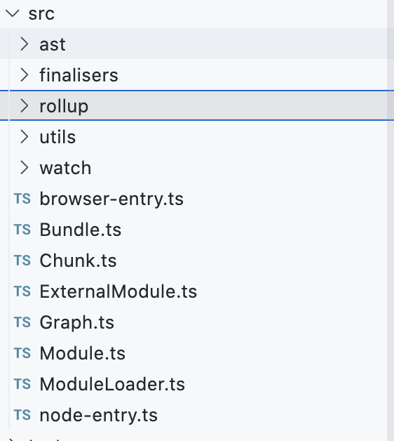
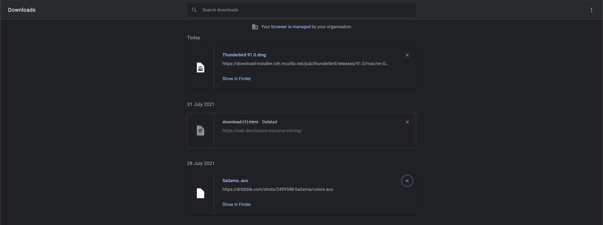
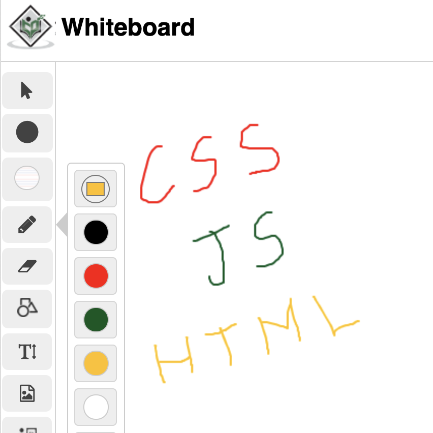

# The Frontend Interview

This repo contains a collection of topics which are frequently asked in a Frontend interview (suitable for **Entry level, Mid-senior level and Senior level**). The questions/topics are categorized based on different areas.

**Some questions might be interrelated and don't follow a specific order.**

> If you have got more questions, feel free to raise a PR to add them to this list. Incase of any clarifications raise an issue.

## Browser internals

1.  How the html gets rendered in the browser ? What happens when we enter a url in the address bar ?

2.  Stages in browser rendering

    -   **DOM & CSSOM** construction
    -   Render tree construction
    -   Layout tree construction
    -   Paint phase
    -   Composite Paint layer

3.  Parser blocking content

4.  Render blocking content

5.  How could we eliminate parser and render blocking content

6.  Critical section of a page

7.  What is `DOMContentLoaded`?

8.  Difference b/w `window.onload` vs `DOMContentLoaded`

9.  Type of scripts - `sync`, `async`, `defer`

    -   Order of script execution
    -   What's the order of execution for following 3 sync scripts appearing in order?
        assume 1KB takes 1ms to download.
        -   script 1 - `30 KB`
        -   script 2 - `20KB (cached)`
        -   script 3 - `5KB`

10. Does font affect rendering and layout phases ? If yes, how to minimize the effect ?

11. How can we lazy load images ?

12. Best practices to place the script and styles in the HTML document ?

13. What is html quirks mode ?

14. How does `transform` doesn't trigger reflow and repaint ?

15. Mention some Web APIs that you have used. How is it different from javascript functionality?

* * *

## HTML Questions - Part 1 - Basics

1.  What does `<!DOCTYPE html>` mean ? What happens if we don't specify it ?

2.  Uses of `<meta>` tag

3.  Semantic **HTML** tags

    -   `<article>`
    -   `<aside>`
    -   `<details>`
    -   `<figcaption>`
    -   `<figure>`
    -   `<footer>`
    -   `<header>`
    -   `<main>`
    -   `<mark>`
    -   `<nav>`
    -   `<section>`
    -   `<summary>`
    -   `<time>`

4.  Block and Inline elements

5.  `<canvas>` vs `<svg>`

6.  HTML element vs HTML Node

7.  innerText vs innerHTML

8.  What is progressive rendering ?

9.  `srcset` attribute in `` tag

10. Image lazy loading

11. How do you serve a page with content in multiple languages ?

12. The use of `hreflang` in `<link>` tag.

13. What is event bubbling ?

14. How event capturing and bubbling works ?

15. What are some use cases of event capturing ?

16. Difference between event.stopPropagation and event.preventDefault ?

17. How do we invalidate a resource file (say html, css, js..) ? Explain about `cache-control` header.

18. How do we avoid unnecessary layout shifts ?

* * *

## CSS Questions - Part 1 - Basics

1.  Selector specificity

    -   How could we override a style which has `!important` ? Is it a best practice to use multiple `!important` styles ?
    -   What's the output of the following code ?

```html
     <style>
       div :nth-child(1) {
         color: green;
       }
       div span {
         color: red;
       }
     </style>
     <div>
       <span>Text</span>
     </div>
```

1.  Positioning in CSS

    -   static
    -   relative
    -   absolute
    -   sticky
    -   fixed

2.  How could we place a content at the bottom right corner of the viewport irrespective of the scroll position ?

    -   Any approaches to achieve the same without fixed type ?

3.  How do we animate a square (50px\*50px) from the left to right end of the screen ?

    -   What are the browser internal phases which are triggered during animation ?
    -   Why do you prefer left over translateX and vice versa ?

4.  Pseudo elements vs Pseudo classes

5.  What are the ways we could center align an element both horizontally and vertically ?

    -   How could we do it with vertical-align and how does vertical-align work ?

6.  What is box-model in CSS ?

7.  What is box-sizing? Difference b/w border-box and content-box

8.  Difference b/w inline-block vs inline

9.  How do we ensure responsive layout in mobile ?

10. Use of `@media` query ?

11. What's the use of z-index ? And stacking context ?

12. Can you apply z-index to a static element ?

13. Difference b/w `visibility: hidden` and `display: none` . Which internal stages are affected if we change the values?

14. Difference b/w `div > span` , `div span` , `div ~ span` , `div + span`

15. If two selectors have same specificity, which selector takes precedence ?

16. How does `float` and `clear` work ?

* * *

### Javascript Questions - Part 1 - Basics

1.  Difference b/w `let` ,`var` and `const`
2.  What's the output of the following ?
```javascript

        let a = 100;
        var b = 200;

        {
          let a = 300;
          var b = 400;
          console.log(a, b);
        }

        console.log(a, b);
```

3.  What's the output ?
```javascript
    let a = 100;
    var b = 200;

    function run() {
      console.log(a, b);

      let a = 300;
      var b = 400;
      console.log(a, b);
    }

    run();
    console.log(a, b);
```

4.  What's the output ?

```javascript
let a = 100;
var b = 200;

function run() {
  console.log(b);

  let a = 300;
  var b = 400;
  console.log(a, b);
}

run();
console.log(a, b);
```

5.  What's the output ?

```javascript
for (var i = 0; i < 5; i++) {
  setTimeout(() => {
    console.log(i);
  }, 1000);
}
```

6.  What's the output ?

```javascript
for (let i = 0; i < 5; i++) {
  setTimeout(() => {
    console.log(i);
  }, 1000);
}
```

7.  Why is the above output are different ? Convert the code of Question 5 to match the same output as Question 6.

8.  What's the output ?

```javascript
let i = 0;
for (; i < 5; i++) {
  setTimeout(console.log, 1000, i);
}
```

9.  Type conversions in Javascript.

10. Difference b/w `==` and `===` ?

11. What's the output? Be familiar with the order of type conversions. You don't have to tell the exact answer, just explaining the order would be enough

```javascript
1 + [] == true;
1 + [] === true;
```

12. What's prototype in Javascript ?

13. Implement the following using prototype in Javascript with es5 standards without `class` keyword.

14. Define a private variable `address` in the class `Student` with es5 standard.

15. Difference between an `Object` and `Map` which would you prefer for implementing dictionary lookup and why ?

16. Implement a polyfill for `Array.prototype.filter`

17. Implement a polyfill for `Array.prototype.flat`

18. Implement a polyfill for `Array.prototype.reduce` // Refer <https://jsvault.com/>

19. What is closure and lexical scoping

20 Write a function to get the following output.

```javascript
sum(10)(20)(30)(); //output: 60
```

21. Write a function to detect the circular dependency

```javascript
let c = {
   level: 'c',
   property: null
};

let b = {
  level: 'b';
  property: c
};

let a = {
  key: 'a',
  property: b
};

a.property.property.property = b;
```

22. Write a function to check whether the opening/close braces match

```javascript
let code = "[()]{}{[()()()}”;
```

23. Write a polyfill for `debounce` and `throttle`

24. Difference b/w `Function.prototype.call` , `Function.prototype.bind` and `Function.prototype.apply`

25. Implement a polyfill for `Promise`

26. Implement a polyfill for `setTimeout`

27. Implement a polyfill for `Promise.all` , `Promise.race` , `Promise.any`

28. What's the output of the following ?

```javascript
const promise = new Promise((resolve, reject) => {
  resolve("output");
  reject("error");
});
promise.then((result) => console.log(result));
promise.catch((error) => console.log(error));
```

29. Write a function to detect whether a API request gets resolved in `2000 ms`

30. Write a function to get the success or failed result of all the async tasks.

    Say: API 1, API 2, API 3 => get all the results/errors irrespective of whether its resolved or failed.

31. Take the following quiz on Promises: <https://www.codingame.com/playgrounds/347/javascript-promises-mastering-the-asynchronous/its-quiz-time>

32. What is event loop ?

33. Explain the output of the following code in terms of event loop and call stack.

```javascript
console.log(1);

function fun() {
  console.log(2);

  setTimeout(() => {
    console.log(3);
  }, 500);

  setTimeout(() => {
    console.log(3);
  }, 0);

  //assume the request resolves in 100 ms.
  fetch("/names").then(() => console.log(res));

  Promise.resolve(5);

  console.log(6);
}

run();
console.log(7);
```

34. What is message queue and task queue in event loop ?

35. What are the types of caching ?

36. Difference b/w http cache and service worker cache

37. Is javascript multi threaded ?

38. How async operations are handled in JS ?

39. What's a service worker ?

40. Life cycles of a Service worker.

41. What's a web worker ?

42. Difference b/w a `callback` and a `Promise`.

## HTTP 

1.  What are the known http request methods ?
2.  Use case for PATCH
3.  Status code types
4.  What is Content Type in request and response ?
5.  Last modified time and Etag in request.
6.  Difference b/w `http` and `https` ?
7.  Difference b/w `http 1.1` vs `http 2` ?

## Security

1.  Explain `XSS` and how to prevent it ?
2.  Explain `CSRF` and how to prevent it ?
3.  Explain `CORS` and why do we need it ?
4.  Explain `IFRAME options`
5.  How do we ensure security in web socket connections ?
6.  Setting values via `innerHTML` vs `innerText`
7.  Explain about Cookies and sessions.

## Design round questions

1.  Implement a tool tip with pure css
2.  Design a snake and ladder game with two players for Player A and Player B
3.  How would you design a file explorer that you have in Atom or VS code editor like below ?



4.  Implement a polyfill for a `Promise`.

5.  Implement an `auto-complete` component like google search.

6.  Implement a Super Mario game within a board of 64\*64 cells with mushrooms and poisons at random places. Whenever the Mario picks up the mushroom, the places of the mushrooms and poisons should change and the score should be tracked.

7.  How would you design a lazy loading list component like LinkedIn/Facebook feed list?

8.  Design a webapp like Whatsapp Web. Explain the component design architecture.

9.  Design a page like Google Chrome Downloads which should also handle the file downloading functionality.



10. Design a whiteboard which should work across multiple devices. How would you convert data of the text/drawings done on the board into digital information ?



11. How would you design the front page of a news article website ? What parameters would you keep in consideration ? How would you optimize it ?

12. How would you design a system that will Cache the **last 10 requests** made in an application and lookup the Cache if request is already in Cache?

13. How would you track the Framework errors in an application ?

14. What features do you consider before deploying an application in production like minification, uglify, route splitting... ?

          
